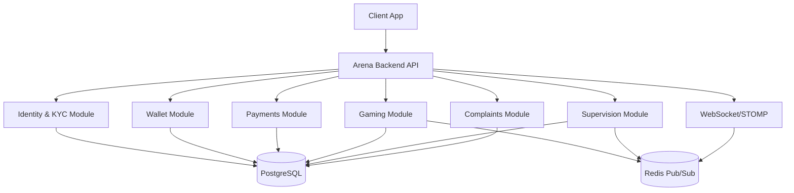

Arena Backend is a **Modular Monolith** built with [Spring Modulith](https://spring.io/projects/spring-modulith), following Domain-Driven Design (DDD) principles. Each business capability lives in its own bounded context with clearly defined public interfaces — modules communicate through domain events rather than direct method calls. This architecture delivers the operational simplicity of a single deployable unit today, while making it straightforward to extract individual modules into standalone microservices as business demands grow.

<Note>
  While the internals are modular, the public API is a single unified surface.
  You interact with one base URL — `https://api.arena.gg` — regardless of which
  domain you are calling.
</Note>

## Domain Modules

The platform is divided into six bounded contexts. Each module owns its data, exposes a public API facade, and publishes events when its state changes.

<CardGroup cols={2}>
  <Card title="Identity & KYC" icon="user-shield" href="/auth/overview">
    Manages user accounts, authentication credentials, role assignments, and
    manual identity verification workflows. No real-money play is permitted
    until a KYC agent approves the submitted documents.
  </Card>
  <Card title="Wallet" icon="wallet" href="/wallet/overview">
    Maintains a **double-entry ledger** ensuring every debit has a matching
    credit. Exposes balance queries, internal transfers between players, and
    transaction history. The ledger is the source of truth for all funds on
    the platform.
  </Card>
  <Card title="Payments" icon="credit-card" href="/wallet/deposits">
    Integrates with the **PayPal Orders API v2** to handle the full deposit
    lifecycle: order creation, buyer approval redirect, webhook processing, and
    automatic balance crediting. Also manages withdrawal requests.
  </Card>
  <Card title="Gaming" icon="gamepad" href="/gaming/game-lifecycle">
    Orchestrates game rooms from creation through match completion. Handles
    player joins, entry-fee escrow, result submission, and prize distribution
    back to the Wallet module.
  </Card>
  <Card title="Supervision" icon="eye" href="/gaming/supervision">
    Provides live match monitoring for platform supervisors. Tracks in-progress
    matches, calculates platform commissions, and flags anomalous results for
    manual review.
  </Card>
  <Card title="Complaints" icon="flag" href="/api/complaints">
    Allows players to file disputes against match results. Routes cases to
    supervisors, tracks resolution status, and triggers corrective wallet
    adjustments when a dispute is upheld.
  </Card>
</CardGroup>

---

## Technology Stack

| Layer | Technology |
|---|---|
| **Application Framework** | Java 21 + Spring Boot 3 |
| **Modularity** | Spring Modulith |
| **Database** | PostgreSQL 16 |
| **Caching & Messaging** | Redis (Pub/Sub + Cache) |
| **Real-Time Transport** | WebSocket / STOMP |
| **Authentication** | JWT RS256 (asymmetric key pair) |
| **Payment Provider** | PayPal Orders API v2 |
| **Observability** | Prometheus metrics + Grafana dashboards |

---

## Event-Driven Communication

Modules never import each other's internal classes. Instead, they publish **domain events** to a shared event bus (backed by Spring's `ApplicationEventPublisher`). Consumers subscribe to the events they care about, keeping each module independently deployable and testable.

**Example domain events:**

| Event | Published By | Consumed By |
|---|---|---|
| `GameRoomCreatedEvent` | Gaming | Supervision, Wallet (escrow) |
| `DepositConfirmedEvent` | Payments | Wallet (credit balance), Identity (KYC trigger) |
| `GameResultSubmittedEvent` | Gaming | Supervision (review), Wallet (payout), Complaints (baseline) |

This design means you can add a new subscriber — for example, a future Notifications module — without modifying the module that publishes the event.

---

## Real-Time Architecture

Arena Backend exposes a WebSocket endpoint at `/ws/arena` using the STOMP sub-protocol. Clients subscribe to topic destinations (e.g., `/topic/rooms/{roomId}`) and receive push updates the instant the server-side state changes.

To support **horizontal scaling** across multiple application instances, the platform uses **Redis Pub/Sub** as the STOMP message broker relay:

1. Any application instance publishes an event to a Redis channel.
2. Redis broadcasts the message to all other instances subscribed to that channel.
3. Each instance forwards the message to the connected WebSocket clients it manages.

This means you can run as many Arena Backend instances behind a load balancer as you need without clients missing events or receiving duplicate messages.

See [Real-Time Events](/realtime/websocket) for subscription destinations, message schemas, and authentication over WebSocket.

---

## Security Model

| Concern | Implementation |
|---|---|
| **Token algorithm** | JWT signed with RS256 (asymmetric key pair — private key signs, public key verifies) |
| **Access token lifetime** | 15 minutes — short-lived to limit exposure if a token is intercepted |
| **Refresh token lifetime** | 7 days — used to silently obtain a new access token without re-login |
| **Roles** | `PLAYER` · `SUPERVISOR` · `ADMIN` — enforced at the endpoint level via Spring Security |
| **KYC gate** | Real-money endpoints reject requests from accounts whose `kycStatus` is not `APPROVED` |

---

## Architecture Diagram

The diagram below shows how a client request flows through the unified API surface and is handled by the appropriate domain module, with all modules sharing the PostgreSQL database and the real-time path flowing through Redis.

