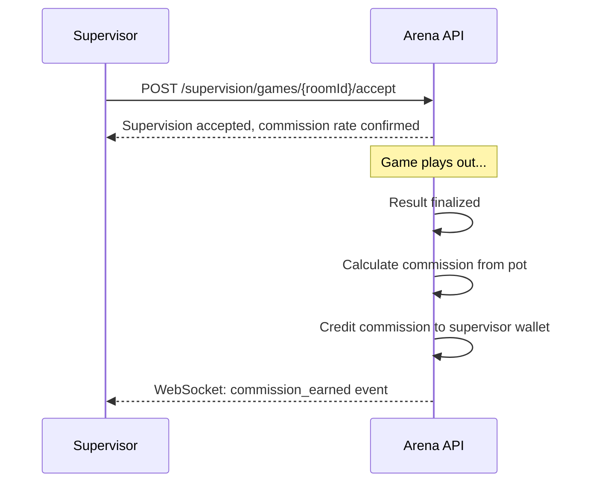

Supervisors earn a commission on every game they supervise. Commissions are automatically credited to your Arena wallet when the game concludes and the result is finalised — there is nothing extra for you to do. This page explains how the commission is calculated, where to view your earnings, and how to withdraw funds.

## How Commissions Work

Your commission is calculated as a percentage of the total pot — the combined stakes of all players in the game room.

**Example calculation**

| Item                      | Value   |
| ------------------------- | ------- |
| Player A stake            | $10.00  |
| Player B stake            | $10.00  |
| Total pot                 | $20.00  |
| Commission rate           | 2%      |
| **Supervisor earns**      | **$0.40** |

The commission is deducted from the pot before the winner receives their payout. Neither player is charged an extra amount; the commission comes out of the pot alongside the platform fee.

## Commission Rates

Rates can vary by game type and are always displayed on the supervision request before you accept. Review the `commissionRate` field in the supervision listing to confirm your expected earnings before committing to a game.

| Game type       | Standard commission rate |
| --------------- | ------------------------ |
| All game types  | 2% of total pot          |

Platform administrators can configure custom rates for specific game types or tournaments. You will always see the exact rate that applies to a given room before you accept.

## Commission Lifecycle

The sequence below shows the full journey from accepting supervision to receiving your commission in your wallet.



When the `commission_earned` WebSocket event fires, your wallet balance has already been updated. You can verify the credit immediately via the commissions endpoint or your wallet transaction history.

<Tip>
  Disputed games do not credit your commission until the dispute is fully
  resolved. If you override a result or validate the outcome, the commission is
  credited at that point. Monitor the `/topic/games/{roomId}` WebSocket topic
  for the `GAME_COMPLETED` event, which signals that your commission has been
  paid.
</Tip>

## Viewing Commission Earnings

Query your commission history with optional date range filters to see a breakdown of every game you supervised.

```bash
GET https://api.arena.gg/api/supervision/commissions
```

**Optional query parameters**

| Parameter  | Type     | Description                              |
| ---------- | -------- | ---------------------------------------- |
| `from`     | ISO 8601 | Start of the date range (inclusive)      |
| `to`       | ISO 8601 | End of the date range (inclusive)        |
| `page`     | integer  | Page number (default `0`)                |
| `size`     | integer  | Results per page (default `20`)          |

**Response `200 OK`**

```json
{
  "totalEarned": "127.40",
  "currency": "USD",
  "commissions": [
    {
      "commissionId": "comm_01J8X...",
      "roomId": "room_01J8X...",
      "gameType": "CHESS",
      "pot": "20.00",
      "rate": 0.02,
      "amount": "0.40",
      "creditedAt": "2024-01-15T14:30:00Z"
    }
  ]
}
```

The `totalEarned` value reflects all commissions credited within the queried date range, or your all-time total if no date filters are applied.

## Commission Payout

Commissions are credited to your Arena wallet immediately upon game completion. Your balance is available to use for staking in your own games or to withdraw.

<Steps>
  <Step title="Commission credited">
    The Arena API credits your commission to your wallet the moment a supervised
    game is finalised. The transaction appears in your wallet history with the
    type `COMMISSION`.
  </Step>
  <Step title="Review your balance">
    Check your wallet balance or query `GET /api/supervision/commissions` to
    confirm the credit.
  </Step>
  <Step title="Withdraw funds">
    Use the standard withdrawal flow to transfer your balance to your linked
    bank account or payment method. Full withdrawal documentation is coming
    soon.
  </Step>
</Steps>

<Note>
  All commission credits appear in your wallet transaction history with the
  transaction type `COMMISSION`. You can filter your wallet history by this type
  to see a consolidated view of your supervision earnings.
</Note>
