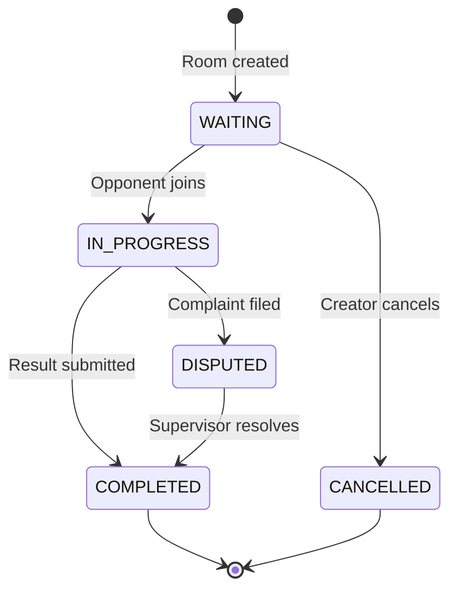

Game rooms are the core competitive unit in Arena. Players create private rooms with a stake amount, opponents join, the match is played off-platform, and the Arena API distributes winnings automatically once both players agree on a result. Every stake is held in escrow from the moment a room is created until the game concludes.

## Game Room States

A room moves through a well-defined set of states from creation to completion. Understanding this lifecycle helps you handle edge cases such as disputes and cancellations.



## Creating a Game Room

Send a `POST` request to `/api/games/rooms` to create a new room. The `stakeAmount` is immediately locked from your wallet at the moment the room is created.

```bash
POST https://api.arena.gg/api/games/rooms
```

**Request body**

```json
{
  "gameType": "CHESS",
  "stakeAmount": "10.00",
  "currency": "USD",
  "maxPlayers": 2,
  "isPrivate": false,
  "requiresSupervision": false
}
```

**Response `201 Created`**

```json
{
  "roomId": "room_01J8X...",
  "status": "WAITING",
  "gameType": "CHESS",
  "stakeAmount": "10.00",
  "creatorId": "usr_01J8X...",
  "createdAt": "2024-01-15T12:00:00Z",
  "joinCode": "ABC123"
}
```

Share the `joinCode` with your opponent so they can join the room directly. The room status remains `WAITING` until an opponent joins.

<Note>
  The `stakeAmount` is locked from your wallet immediately when the room is
  created. If you cancel the room before an opponent joins, the full stake is
  returned to your wallet.
</Note>

## Joining a Room

An opponent can join a room in two ways:

- **By room ID** — `POST /api/games/rooms/{roomId}/join`
- **By join code** — `POST /api/games/rooms/join` with `{ "joinCode": "ABC123" }` in the request body

When the opponent joins, their stake is locked from their wallet and the room transitions from `WAITING` to `IN_PROGRESS`. Both players receive an immediate real-time notification via WebSocket confirming the match has started.

```bash
POST https://api.arena.gg/api/games/rooms/{roomId}/join
```

## Submitting a Result

Once the match concludes, either player submits the outcome via `POST /api/games/rooms/{roomId}/result`.

```bash
POST https://api.arena.gg/api/games/rooms/{roomId}/result
```

**Request body**

```json
{
  "winnerId": "usr_01J8X...",
  "proof": "screenshot_url_or_description"
}
```

<Steps>
  <Step title="Player one submits result">
    The first player submits their claimed outcome along with any proof such as a
    screenshot URL or match description.
  </Step>
  <Step title="Player two submits result">
    The second player submits their version of the outcome independently.
  </Step>
  <Step title="Automatic resolution">
    If both submissions name the same winner, winnings are distributed instantly
    and the room moves to `COMPLETED`.
  </Step>
  <Step title="Dispute (if results conflict)">
    If the two submissions disagree, the room enters `DISPUTED` state and a
    supervisor is assigned to review the evidence and make a final ruling.
  </Step>
</Steps>

## Winnings Distribution

When a result is finalised, the platform automatically calculates and distributes winnings. The table below shows an example for a standard two-player game with a 10% platform fee and an optional 2% supervisor commission.

| Item                         | Amount  |
| ---------------------------- | ------- |
| Each player stakes           | $10.00  |
| Total pot                    | $20.00  |
| Platform fee (10%)           | $2.00   |
| Supervisor commission (2%)   | $0.40   |
| **Winner receives**          | **$17.60** |

Supervisor commission only applies when `requiresSupervision` is `true` on the room. See [Commissions](/gaming/commissions) for full details.

## Cancelling a Room

You can cancel a room that is still in `WAITING` status using the `DELETE` method. Once an opponent has joined and the room is `IN_PROGRESS`, cancellation is no longer available.

```bash
DELETE https://api.arena.gg/api/games/rooms/{roomId}
```

A successful cancellation returns `204 No Content` and your staked amount is returned to your wallet in full.

<Note>
  Rooms with `requiresSupervision: true` will not transition from `WAITING` to
  `IN_PROGRESS` until a supervisor accepts the oversight request. See{" "}
  <a href="/gaming/supervision">Supervision</a> for details on how supervisors
  join a game room.
</Note>

<CardGroup cols={2}>
  <Card title="Supervision" icon="eye" href="/gaming/supervision">
    Learn how supervisors monitor live matches and resolve disputes.
  </Card>
  <Card title="Sanctions" icon="gavel" href="/gaming/sanctions">
    Understand the sanctions supervisors can apply for rule violations.
  </Card>
  <Card title="Games API Reference" icon="code" href="/api/games">
    Full reference for all game room endpoints.
  </Card>
  <Card title="WebSocket Events" icon="bolt" href="/realtime/websocket">
    Subscribe to real-time game events using the Arena WebSocket API.
  </Card>
</CardGroup>
