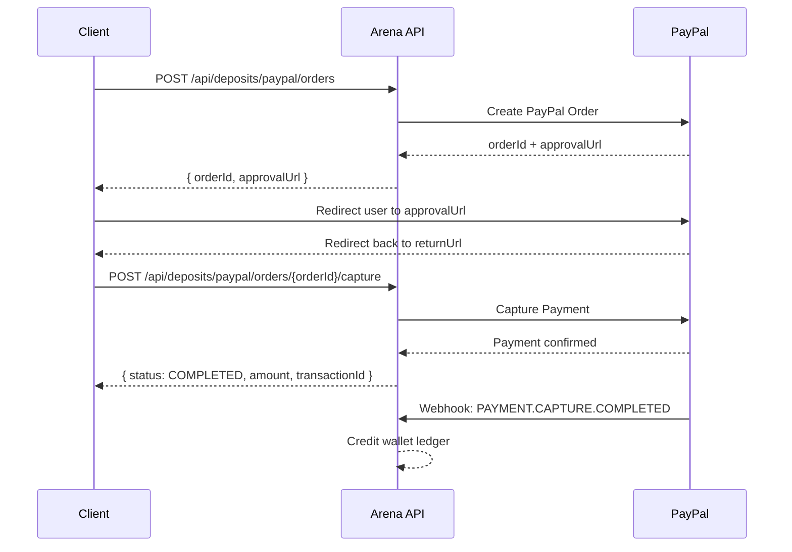

Deposits follow a two-step process using PayPal Orders API v2. You create an order to receive a PayPal approval URL, redirect the player to approve the payment on PayPal, then capture the payment on their return to credit the wallet. This flow keeps sensitive payment credentials off your client and gives the player a familiar, trusted checkout experience.

## Prerequisites

Before initiating a deposit, make sure the following conditions are met:

- The player has completed **KYC (Know Your Customer) verification** on their Arena account
- The player has a **valid PayPal account** to approve the payment
- Your server is ready to receive the post-capture redirect and call the capture endpoint

## Deposit Flow

The sequence below shows the full round trip from order creation through wallet credit.



## Step 1 — Create Order

Send a `POST` request to create a new PayPal order. Arena forwards the request to PayPal and returns an `approvalUrl` that you redirect the player to.

```bash
POST /api/deposits/paypal/orders
```

**Request Body**

```json
{
  "amount": "25.00",
  "currency": "USD",
  "returnUrl": "https://yourapp.com/deposit/success",
  "cancelUrl": "https://yourapp.com/deposit/cancel"
}
```

| Field | Type | Description |
|---|---|---|
| `amount` | string | Deposit amount as a decimal string |
| `currency` | string | ISO 4217 currency code — currently `USD` only |
| `returnUrl` | string | URL PayPal redirects the player to after approval |
| `cancelUrl` | string | URL PayPal redirects the player to if they cancel |

**Response**

```json
{
  "orderId": "9XJ10437XK779370H",
  "status": "CREATED",
  "approvalUrl": "https://www.sandbox.paypal.com/checkoutnow?token=9XJ10437XK779370H"
}
```

Redirect the player to `approvalUrl` immediately after receiving this response. Do not delay — PayPal orders expire after 3 hours.

## Step 2 — Capture Payment

After the player approves the payment on PayPal, they are redirected back to your `returnUrl`. At this point, call the capture endpoint from your **server** to finalize the payment.

```bash
POST /api/deposits/paypal/orders/{orderId}/capture
```

Replace `{orderId}` with the value returned in Step 1.

**Response**

```json
{
  "depositId": "dep_01J8X...",
  "orderId": "9XJ10437XK779370H",
  "status": "COMPLETED",
  "amount": "25.00",
  "currency": "USD",
  "walletBalance": "70.50"
}
```

A `status` of `COMPLETED` means PayPal accepted the capture request. The `walletBalance` field reflects the player's total balance after the deposit is applied.

<Warning>
  Wallet credit happens asynchronously via a PayPal webhook (`PAYMENT.CAPTURE.COMPLETED`) even when the capture response already shows `COMPLETED`. Allow a few seconds for the available balance to reflect before displaying it to the player. Poll `GET /api/wallet/balance` or listen for the webhook to confirm the ledger has been updated.
</Warning>

## Deposit Limits

<Note>
  The minimum deposit amount is **$5.00** and the maximum is **$500.00** per transaction. Requests outside this range are rejected with a `400 Bad Request` error. For higher limits, contact Arena support.
</Note>

## Deposit Status Values

Track the lifecycle of a deposit using the `status` field returned on the deposit resource.

| Status | Description |
|---|---|
| `CREATED` | Order has been created; awaiting player approval on PayPal |
| `APPROVED` | Player has approved the payment; awaiting capture |
| `COMPLETED` | Payment captured and wallet credit confirmed |
| `FAILED` | Capture attempt failed or PayPal declined the payment |
| `CANCELLED` | Player cancelled on PayPal, or the order expired before capture |

## View Your Deposit History

Retrieve a paginated list of your past deposits to check the status of a recent payment or review your funding history.

```bash
GET /api/deposits
```

**Query Parameters**

| Parameter | Type | Description |
|---|---|---|
| `page` | integer | Zero-based page index (default: `0`) |
| `size` | integer | Number of results per page (default: `20`, max: `100`) |
| `status` | string | Filter by deposit status (optional) — e.g. `COMPLETED`, `FAILED` |

**Response**

```json
{
  "content": [
    {
      "depositId": "dep_01J8X...",
      "orderId": "9XJ10437XK779370H",
      "status": "COMPLETED",
      "amount": "25.00",
      "currency": "USD",
      "createdAt": "2024-10-15T14:30:00Z",
      "completedAt": "2024-10-15T14:32:00Z"
    }
  ],
  "page": 0,
  "size": 20,
  "totalElements": 12,
  "totalPages": 1
}
```

Each deposit record includes the associated `orderId` so you can cross-reference with a specific PayPal order. All monetary values are returned as decimal strings.
