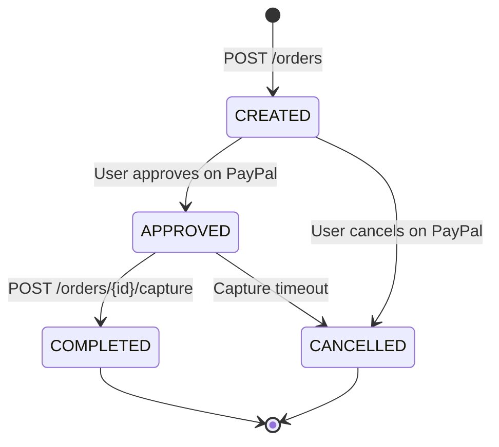

Arena Backend integrates with PayPal Orders API v2 for all real-money deposits. This page covers how the integration works under the hood, how to test safely in the sandbox environment, and how to handle the edge cases you are most likely to encounter in production.

## Environments

Arena exposes the same deposit API endpoints in both environments. The environment is determined by the credentials configured on the Arena Backend server, not by anything you pass in the request.

| Environment | Purpose | PayPal Credentials | Real Money |
|---|---|---|---|
| **Sandbox** | Development and QA testing | PayPal sandbox app credentials | No — test funds only |
| **Production** | Live player payments | Verified PayPal Business account credentials | Yes |

Contact your Arena integration team to confirm which environment your API key is scoped to before processing any payments.

## PayPal Sandbox Testing

Use the sandbox environment to run end-to-end deposit flows without moving real money.

<Steps>
  <Step title="Get sandbox buyer credentials">
    Log in to the [PayPal Developer Dashboard](https://developer.paypal.com/dashboard/) and navigate to **Sandbox → Accounts**. Use one of the pre-generated buyer accounts or create a new one. Sandbox buyer accounts look like:

    ```
    Email:    sb-buyer47xyz@personal.example.com
    Password: TestPass1234!
    ```
  </Step>
  <Step title="Create a deposit order">
    Call `POST /api/deposits/paypal/orders` as you would in production. The `approvalUrl` returned will point to `sandbox.paypal.com`.
  </Step>
  <Step title="Approve on sandbox.paypal.com">
    Open the `approvalUrl` in a browser and log in with your sandbox buyer account credentials. Approve the payment to be redirected back to your `returnUrl`.
  </Step>
  <Step title="Capture the order">
    Call `POST /api/deposits/paypal/orders/{orderId}/capture` from your server. The response and the wallet credit behave identically to production.
  </Step>
</Steps>

<Tip>
  Always run your full integration — including webhook handling — against the sandbox before going live. Sandbox webhooks fire in the same way as production events, so you can verify your signature verification logic without risk.
</Tip>

## Order Lifecycle

A PayPal order moves through a defined set of states from creation to final resolution. Understanding this lifecycle helps you handle redirects and edge cases correctly.



- **CREATED → APPROVED**: The player logs into PayPal and clicks *Approve*. No funds move yet.
- **APPROVED → COMPLETED**: Your server calls the capture endpoint. PayPal debits the buyer and confirms the transfer.
- **Any state → CANCELLED**: The player cancels, or the order reaches its 3-hour expiry without being captured.

Once an order reaches `COMPLETED` or `CANCELLED`, it is terminal and cannot be transitioned further.

## Error Handling

PayPal returns structured error codes when an operation cannot be completed. Arena surfaces these as error responses on the relevant deposit endpoints. The table below covers the most common codes and the recommended action for each.

| Error Code | Cause | Recommended Action |
|---|---|---|
| `ORDER_NOT_APPROVED` | You called capture before the player approved the payment | Redirect the player back to the `approvalUrl` to complete approval |
| `ORDER_ALREADY_CAPTURED` | The capture endpoint was called more than once for the same order | Do not retry — call `GET /api/deposits/{depositId}` to check the existing deposit status |
| `INSTRUMENT_DECLINED` | PayPal rejected the player's payment method (e.g. insufficient funds, card block) | Ask the player to try a different funding source; create a new order |
| `ORDER_EXPIRED` | The order is older than 3 hours and can no longer be approved or captured | Create a new order and direct the player through the flow again |

<Accordion title="What happens if the player closes the browser mid-flow?">
  If the player navigates away before approving, the order stays in `CREATED` state until it expires after 3 hours. No funds are moved. You can safely create a new order for the player — the expired order has no effect on their wallet or account.
</Accordion>

## Webhook Verification

PayPal sends signed webhook events to Arena's backend to confirm that payments have been captured. Arena verifies every incoming webhook using HMAC-SHA256 before making any changes to the wallet ledger. This means your wallet credit is always backed by a cryptographically verified event from PayPal, not just the capture API response.

See the [Webhooks](/wallet/webhooks) page for the full verification process, supported event types, and payload examples.

<Tip>
  Always implement the capture call on your **backend server**, never from client-side JavaScript. Performing the capture server-side prevents a malicious actor from intercepting or replaying the capture request to manipulate deposit amounts.
</Tip>
